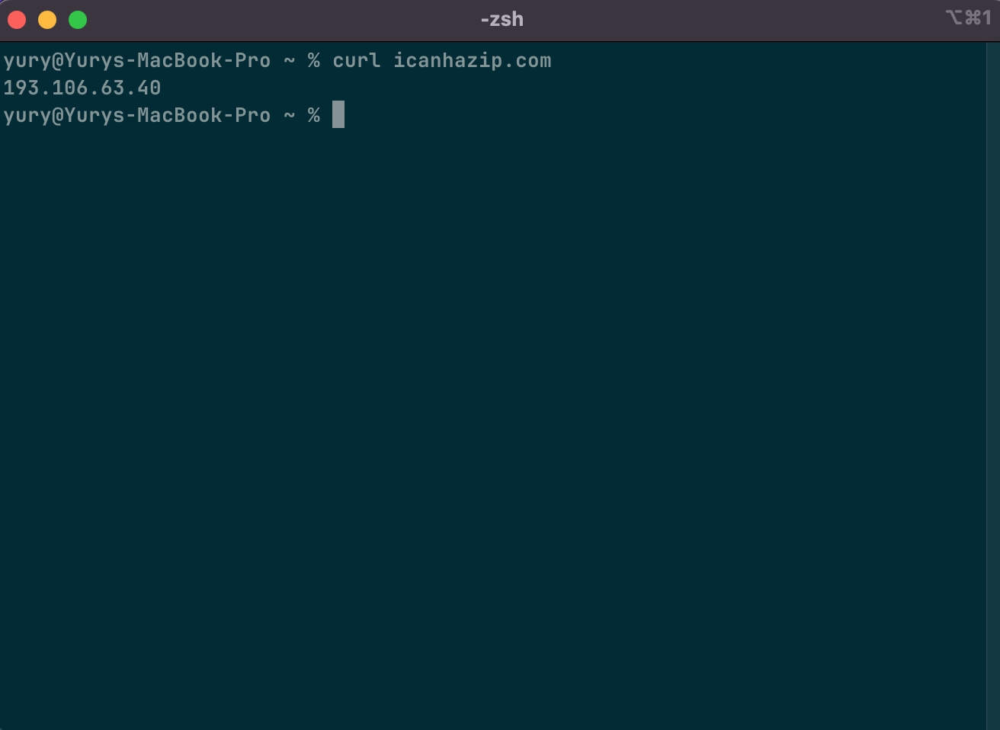
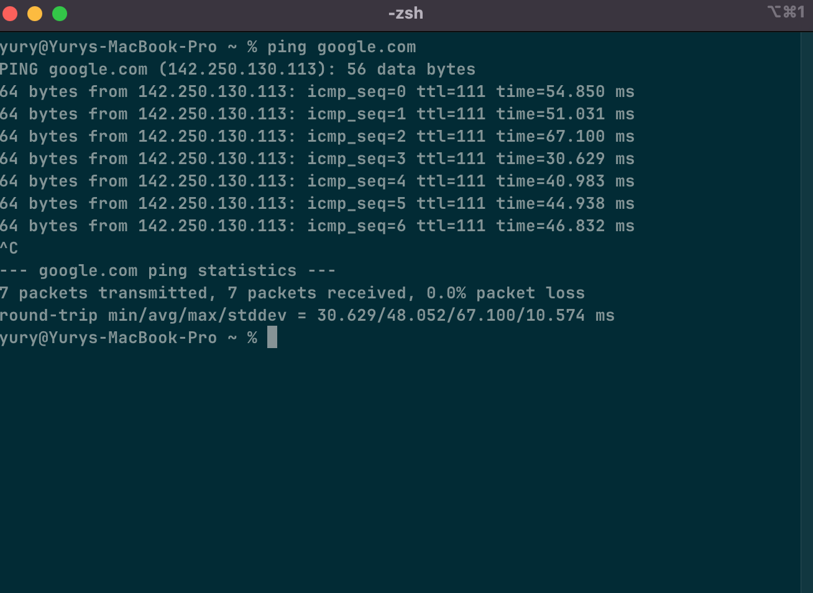
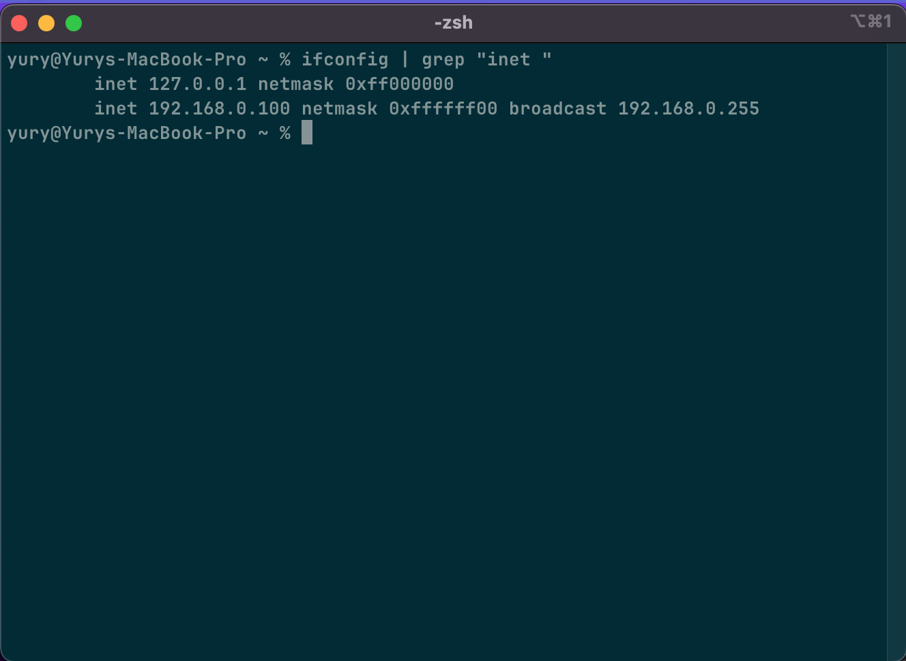

# Day 1 — Networking Basics

## What I learned

Local network (LAN) works inside a room. It connects computers, printers, and
other devices.  
External network (WAN) is for internet.  
I learned how to check my local and external IP.

## My local IP

192.168.0.100

## My external IP

193.106.63.40

## Ping result

64 bytes from 142.250.109.138: icmp_seq=0 ttl=111 time=52.639 ms

## Conclusion

It was not very difficult. I understand what local and external IP are and what
LAN and WAN mean.

## Screenshots

Local IP:  

Ping result:  

External IP:  

