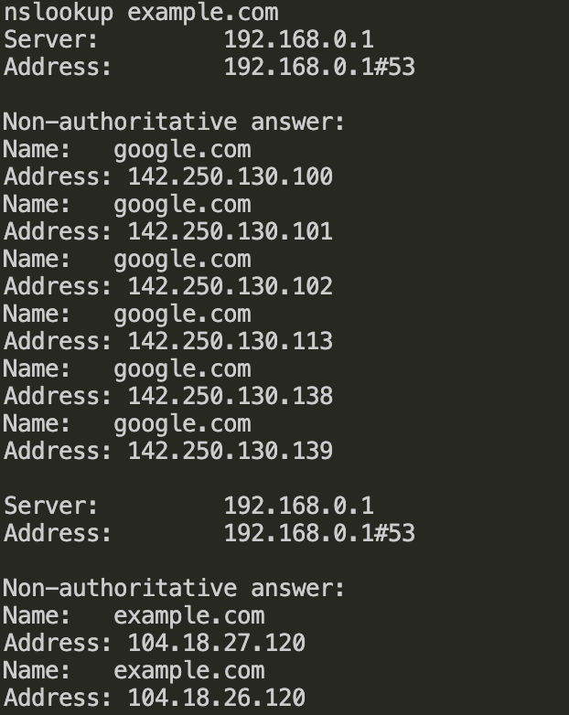
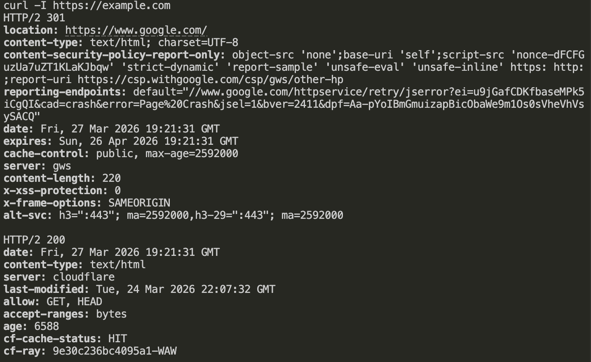
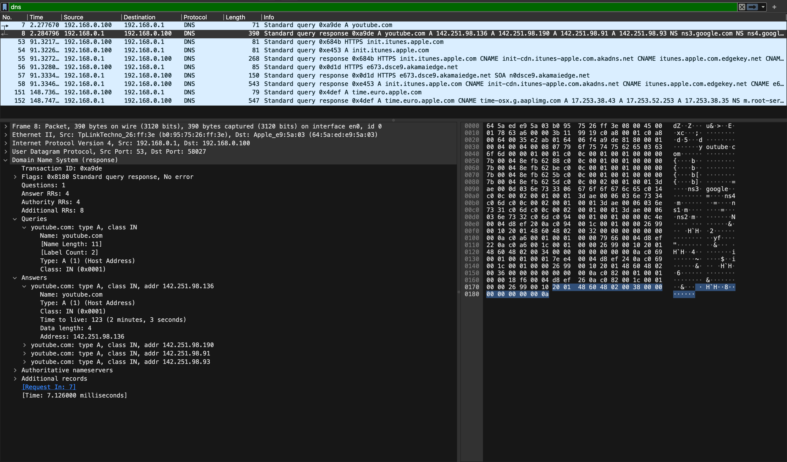
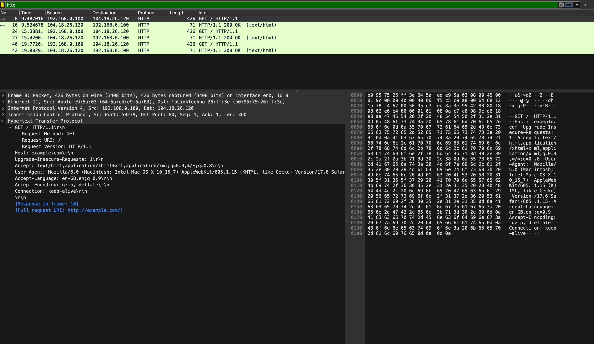

# Day 2 — DNS + HTTP + Wireshark

## What I understood

DNS changes a website name into an IP address.  
HTTP is used for communication between the browser and the server.

## DNS

- google.com → (your IP)
- youtube.com → (your IP)

## HTTP

- Server response: 200 OK

## Wireshark

### DNS

I saw how the computer sends a request to the DNS server and gets an IP address.

### HTTP

I saw the GET request and the server response.

## Conclusion

## Wireshark DNS

In Wireshark, I saw how my computer sends a DNS request to the router to get the
website IP address.  
DNS changes the website name into an IP address that is used for connection.

## Wireshark HTTP

I saw an HTTP GET request to the website example.com.  
This is a request to get the main page of the website.  
The server answered with status 200 OK, which means the data was sent
successfully.
