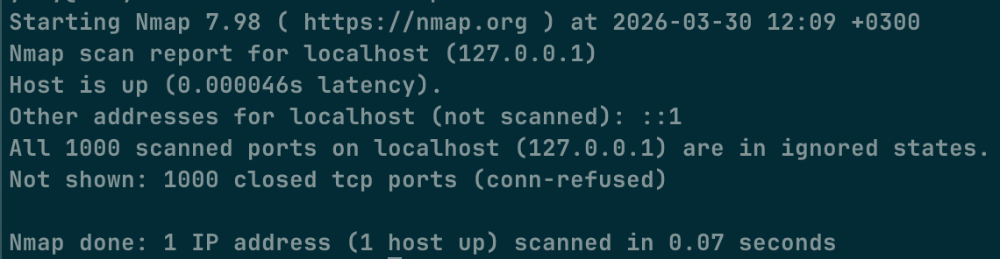
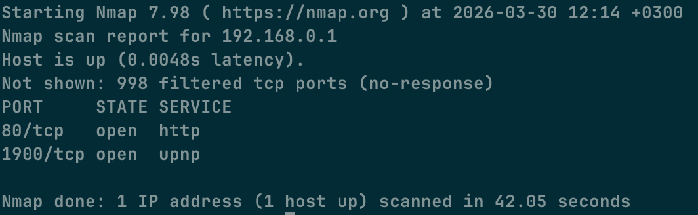
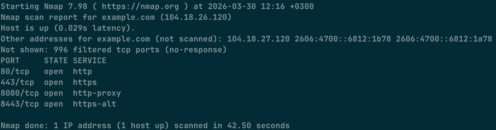

# Day 3 — Ports + Nmap

## What I understood

A port is like a door on a device. Different services use different ports.

## Scan localhost

(which ports are open)

## Scan router

(what I saw)

## Scan website

(usally 80 and 443)

## Conclusion

I understood that a port is an entry point for a service on a device.

On localhost, I had no open ports because no local services were running.

On the router, these ports were open:

- 80 (HTTP)
- 1900 (UPnP)

On the website example.com, these ports were open:

- 80 (HTTP)
- 443 (HTTPS)
- 8080
- 8443

I understood the difference between localhost, the local network, and internet
websites.
