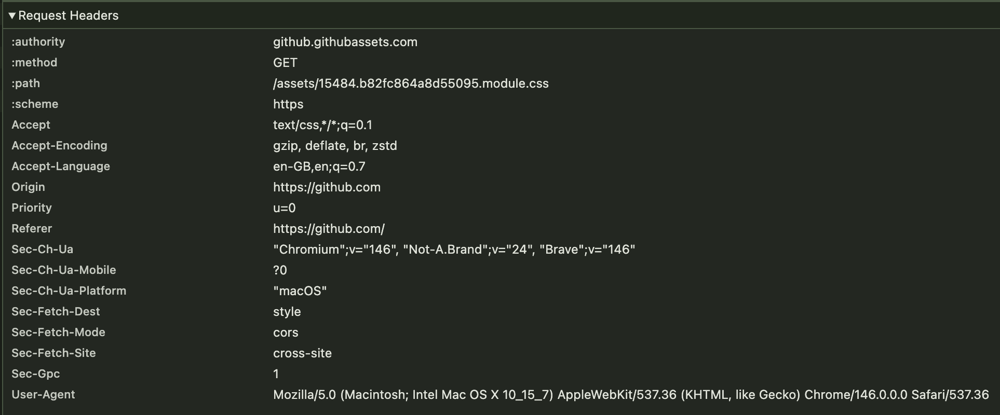
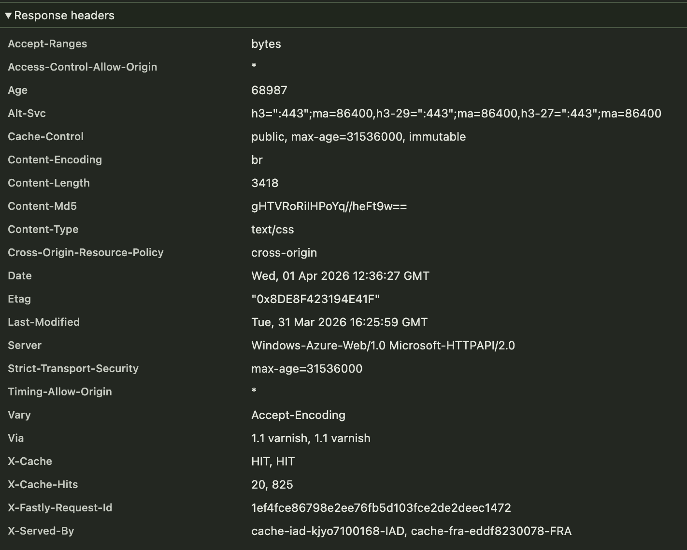
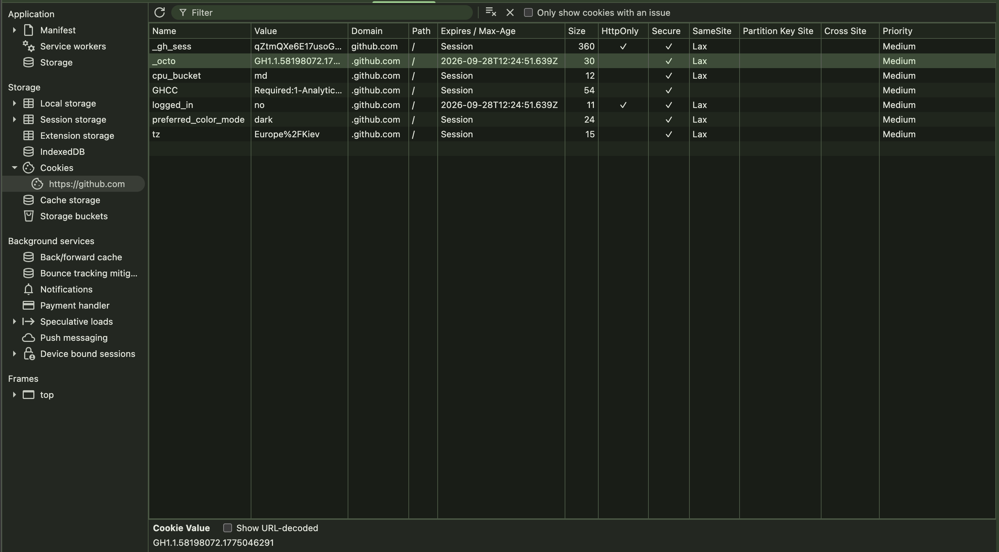
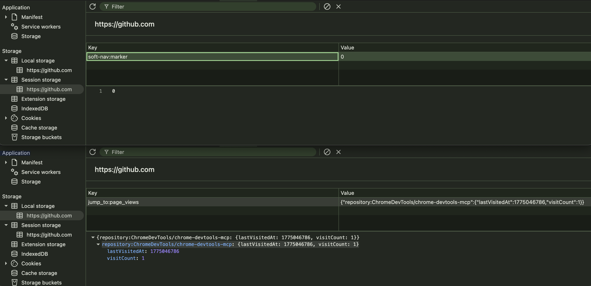

# Day 4 — Web Security Basics

## What I understood

I learned how the browser sends a request and gets a response.

## Request

- Method:
- URL:
- Status:

## Response Headers

- Content-Type
- Server
- Set-Cookie

## Cookies

I looked at the website cookies and saw session data.

## Storage

I learned local storage and session storage.

## Conclusion

I understood how the browser sends a request and gets a response.

In DevTools I saw:

- the main document with status 200 OK
- request and response headers
- website cookies
- Secure and HttpOnly flags

I understood that a cookie is used for session storage and can be sent to the
server, and localStorage keeps data only in the browser.
