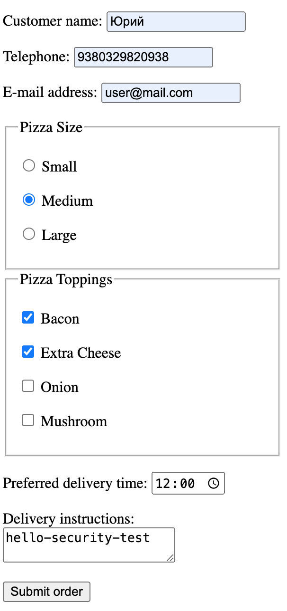
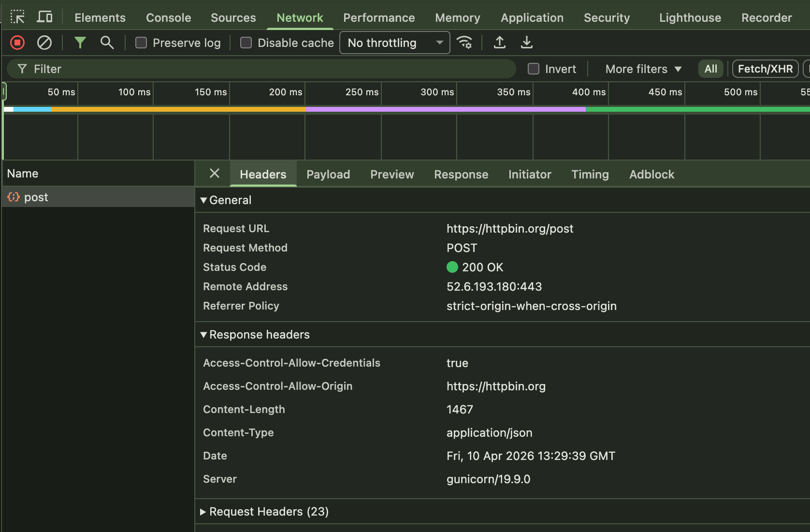
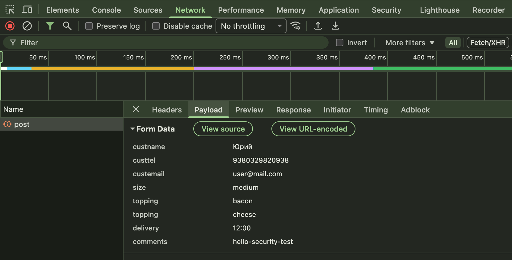
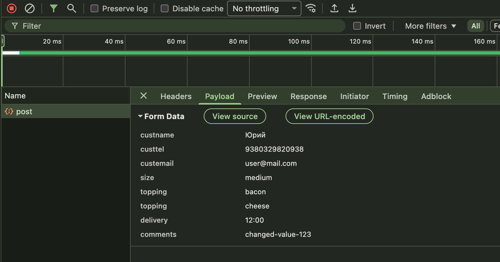

# Day 5 — POST Requests + Forms

## What I understood

POST is used to send form data in the request body.

## POST request

I saw a POST request after sending the form.

## Payload

In the body there were:

- custname
- comments

## Change value

I changed the comments field and saw the new value in the payload.

## Conclusion

I understood the difference between GET and POST.

GET sends data in the URL, and POST sends data in the request body.

After sending the form, I saw these fields in the payload:

- custname
- custtel
- custemail
- size
- topping
- delivery
- comments

I changed the comments value and saw that the new value went to the body. The
server processed the POST request with status 200 OK.
