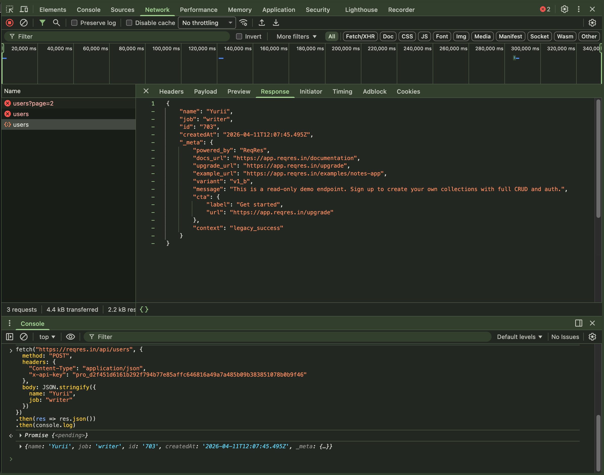
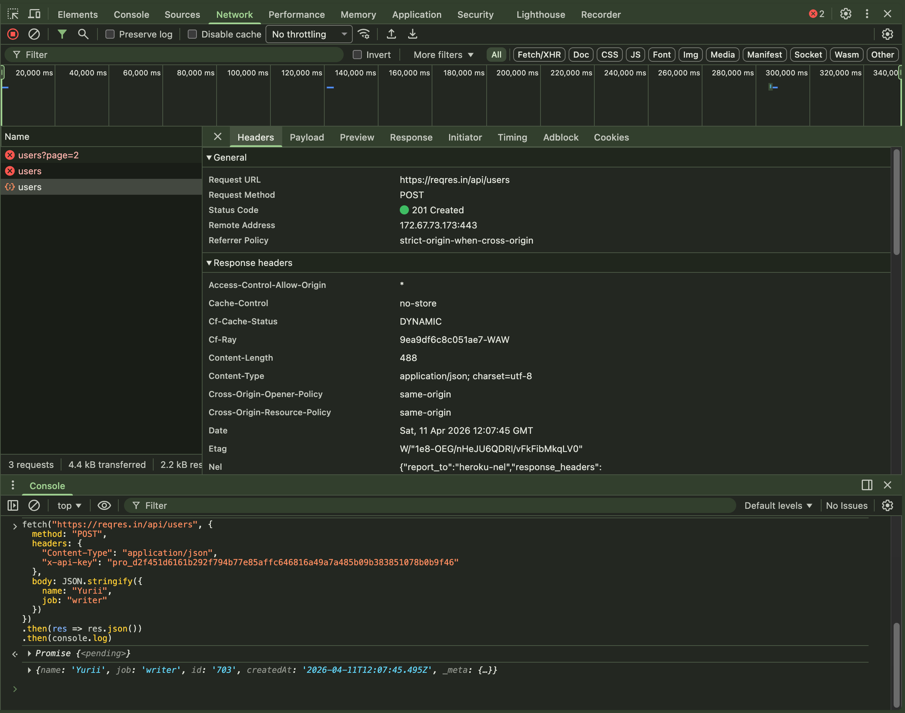
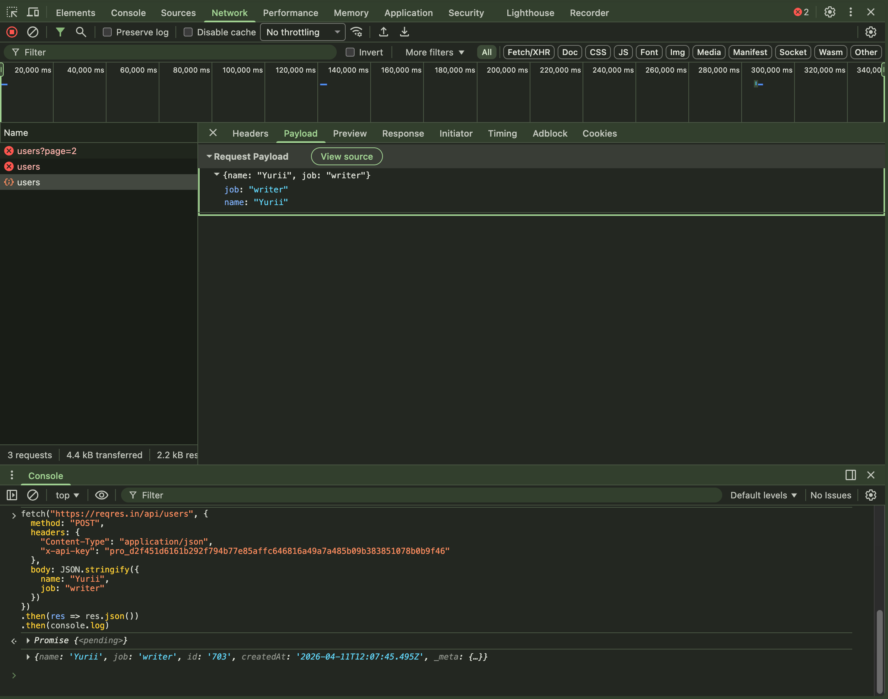

# Day 6 — API + JSON + Debugging

## What I understood

API endpoints can need required authentication headers.  
If the required header is missing, the server returns an access error.

---

## 1. GET request

First, I made a GET request to the API and got JSON with a list of users.

---

## 2. POST request without API key

I sent a POST request with `fetch` without the `x-api-key` header.

---

## 3. Error response

The server returned an error:

- `missing_api_key`
- `401 Unauthorized`

This means the endpoint needs a required authentication header.

---

## 4. Fixed request

After that, I added `x-api-key` to the headers and sent the POST request again.

---

## 5. Success response

After the fix, the server processed the request successfully and returned a
correct JSON response.

---

## 6. Changed JSON value

I changed the value of the `job` field and saw that the new value went to the
JSON body and showed in the response.

---

## Conclusion

I understood that an API can block requests without required authentication
headers.

I also saw a real debugging flow:

`GET → POST → 401 error → fix headers → success`

This helped me better understand how API authentication works and why headers
are important for access control.
